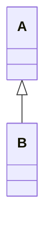

# haha_entertainer

This is a **Flutter** App. This is a simple entertainment app which has 5 services. These are: **quotes, 
facts, jokes, dadjokes** and **riddles**. It fetches these services from an Api : **[https://api.api-ninjas.com/v1/]**, 
and displays it in the app.

## Dart packages required

- http: ^1.2.2
  > Import it as `import 'package:http/http.dart' as http;`
- flutter_launcher_icons: ^0.13.1
  > This is used to set the icon of the app.
  - > [!NOTE]
    > In the pubspec.yaml file, add the following code (as a new section) to set the icon of the app.
    > ```
    > flutter_launcher_icons:
    > android: "launcher_icon"
    > ios: true
    > image_path: "assets/images/emoji_icon_2.png"
    > ```
    > where, image path should be as you have specified in the app.
- rename_app: ^1.6.1
  > Used to rename the app. It simplifies the renaming of the app.
  

## Structure of the Directories

+ lib
  + constants.dart - contains all the URLs and Api links.
  + services
    + api_services.dart
  + screens
    + about_screen.dart
    + home_screen.dart
    + privacy_policy_screen.dart
    + terms_conditions_screen.dart
  + main.dart

## Sequence diagram of the App


  


